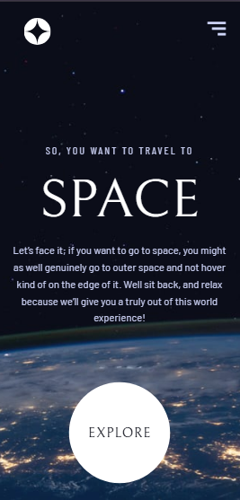
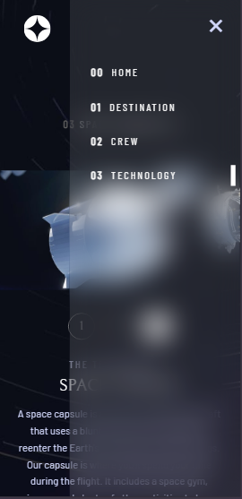

# Space tourism 🚀

## 📚 Table of contents

- [Overview](#overview)
- [Features](#features)
- [Built with](#built-with)

## Overwiev

This is a fully responsive, multi-page website where users can explore various aspects of space travel. From planets and spacecraft to crew members, the site offers an immersive experience built around a sleek and modern design.

## Features

🌍 Multi-Page Layout: Users can navigate between Home, Destination, Crew, and Technology pages, each with its own unique content and design.

🪐 Interactive Destination Selector: Visitors can view details about different planets, including distance and estimated travel time.

👨‍🚀 Animated Crew Section: Switching between crew members reveals smooth transitions and engaging astronaut bios.

🛰️ Technology Carousel: A responsive slider displays various space technologies, with imagery that adapts based on screen size.

📱 Fully Responsive Design: The layout and components adapt seamlessly to mobile, tablet, and desktop devices for a consistent user experience.

🎨 Styled from Figma Design: Built to match a professional UI design from Frontend Mentor, ensuring visual consistency and usability.

## Built with

- HTML5
- CSS 
- Angular 

---
> This is a solution to the [Space tourism website challenge on Frontend Mentor](https://www.frontendmentor.io/challenges/space-tourism-multipage-website-gRWj1URZ3). Frontend Mentor challenges help you improve your coding skills by building realistic projects.

